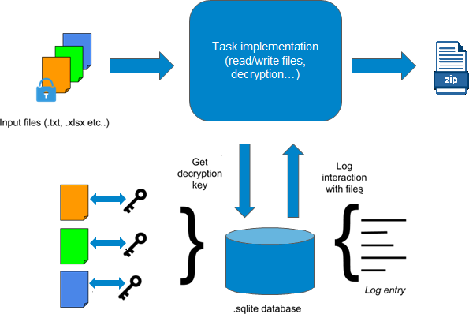

# Decryption_system

This program is file decrypting system. Its using client server architecture in the core of the app. Clinet sends info for path for input directory. In input directory are files
that should be decrypted, and those files are different types. Server should decrypt all the files and log into the databse process of application. All decrypted files should be
zipped and stored in the provided directory.

For the decryption we are using keys that are provided in database.

How to run the application?

1) First, we will start  the server application with 3 different parameters from command prompt:
    
    java –jar server_2.jar portNumber pathToDataBase pathToOutputDir

portNumber - Integer value representing the number of the port on which the server listens
pathToDatabase – String that contains the path to the sqlite3 database file
pathToOutputDir – String that contains path to specific output location where zip file should be stored

2) Next, we will start  the client application with 3 different parameters from new command prompt window:
    
    java –jar client_2.jar serverAddress portNumber pathToInputDir

serverAddress – String that describes the server computer address
portNumber - Integer value representing the port number on which the application will expect requests
pathToInputDir – String that contains the path to the input directory

